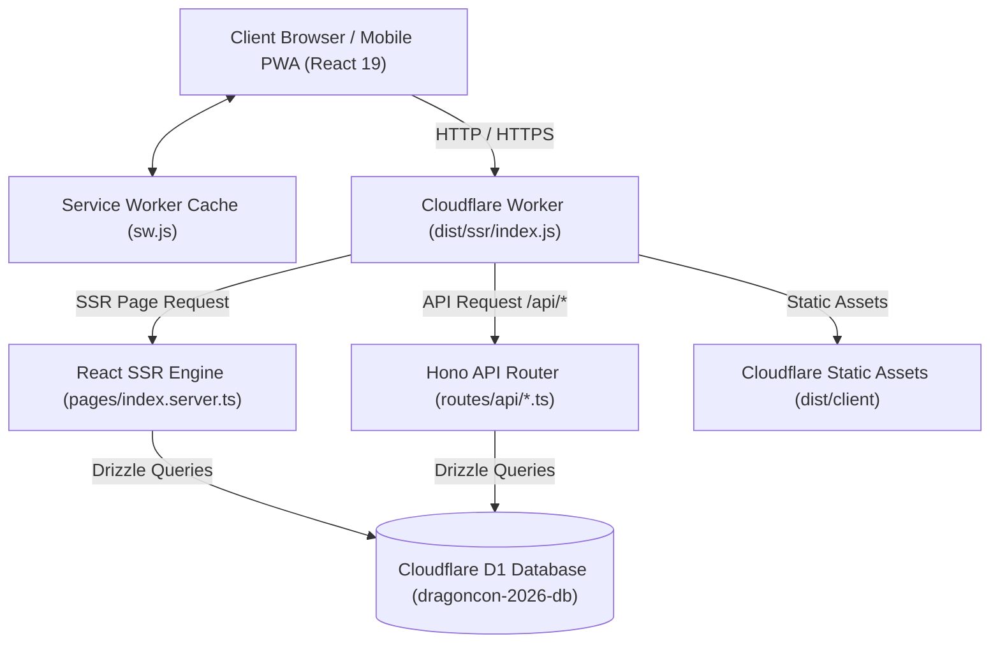
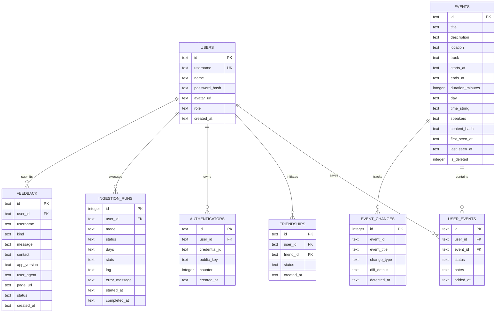
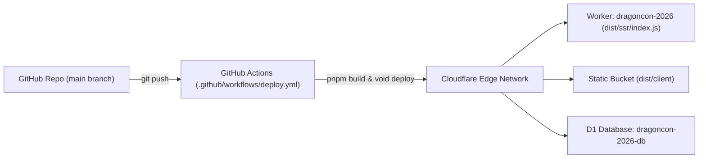

# System Design — CyberDragon Companion App

> Evergreen root document and bundle entry point. Highest-level view of the system and the fastest on-ramp for contributors. When any document disagrees with the code, database, or runtime, the code is the source of truth.

---

## 1. Project Overview

- **Project Identifier:** `2026-08-dragoncon` (CyberDragon PWA).
- **Description:** A mobile-first, offline-capable progressive web application providing full Dragon Con 2026 schedule browsing, real-time pedestrian and skybridge walk-time estimates between Atlanta host venues, room line capacity heuristics, stamina load calculation, and WebAuthn biometric passkey authentication.
- **Stakeholders:** Dragon Con 2026 attendees navigating the multi-hotel Atlanta convention footprint, convention panelists, and the CyberDragon engineering team.
- **Assumptions:** Users frequently experience congested cellular connectivity in hotel ballrooms, requiring local service worker caching, instant offline schedule browsing, and lightweight server-rendered HTML payloads.
- **Core Use Cases:**
  - Fast search, filtering, and time-rail navigation across thousands of convention events.
  - Inter-venue transit estimation accounting for hotel skybridges and street connections.
  - Personal agenda management with stamina meters and overlap conflict detection.
  - Biometric passkey and password account creation backed by edge database storage.
  - One-click `.ics` calendar file export for external calendar synchronization.

---

## 2. Requirements

### 2.1 Functional Requirements
- **Schedule Browsing & Filtering:** Filter events by day, fan track, host venue, search query, and change history (`pages/index.tsx`, `routes/api/events.ts`).
- **Transit Estimation:** Compute pedestrian transit minutes from the previous event's location to the target venue across 6 core Atlanta host venues (`lib/walktime.ts`).
- **Line & Room Capacity Heuristics:** Estimate room fill percentage and line warnings from scheduled time and room size (`lib/walktime.ts`).
- **Authentication & Squads:** Register/login via WebAuthn passkeys or salted SHA-256 passwords (`routes/api/auth.ts`, `routes/api/auth/passkey.ts`).
- **Calendar Export:** Generate RFC 5545 `.ics` payloads containing user-saved panels (`routes/api/export-ics.ts`).
- **Live Ingestion:** Scrape and parse external schedule data into D1 SQLite (`lib/ingest.ts`, `routes/api/ingest.ts`).
- **Admin-Driven Ingestion Control:** Restrict all schedule synchronization to authenticated administrators via a dedicated `/admin` dashboard supporting `sync`, `dry-run` preview, and emergency `hard-resync` modes (`pages/admin.tsx`, `routes/api/admin/ingest.ts`, `lib/auth.ts`).
- **Role-Based Access Control:** Gate administrative endpoints and pages behind a `users.role` designation of `"admin"`, assigned through the `pnpm run make-admin <username>` CLI (`lib/auth.ts`, `scripts/make-admin.ts`).

### 2.2 Non-Functional Requirements
- **Performance:** Sub-10ms Worker cold-start time and instantaneous client-side tab switching.
- **Offline Resilience:** Service worker caching (`public/sw.js`) and client hydration resilience.
- **Portability & Cost:** Runs on Cloudflare Workers + D1 with zero server maintenance; upgraded to the Workers Paid plan ($5/mo) with explicit `limits.cpu_ms` / `limits.subrequests` ceilings in `wrangler.jsonc` for Dragon Con 2026 con-week traffic, to be downgraded back to the Free plan afterward.

---

## 3. System Architecture

### Technology Stack
- **Frontend:** React `19.2.4`, React DOM `19.2.4`, React Compiler (`babel-plugin-react-compiler` `1.0.0`), `@void/react` `0.10.12`.
- **Styling & PWA:** Custom CyberDragon Glass CSS (`public/cyberdragon.css`), Web App Manifest (`public/manifest.webmanifest`), Service Worker (`public/sw.js`).
- **Head & Responsive Design:** Centralized document `<head>` management in `void.json` (`width=device-width, initial-scale=1, viewport-fit=cover`), `-webkit-text-size-adjust: 100%`, and hardware safe-area insets (`env(safe-area-inset-bottom)`, `env(safe-area-inset-top)`).
- **API & Server:** Hono `4.11.9`, `@simplewebauthn/server` `13.3.2`, `@simplewebauthn/browser` `13.3.0`, Cheerio `1.2.0`.
- **Database & Tooling:** Cloudflare D1 (SQLite), Drizzle ORM (via `void/db`), Vite `8.0.10`, `vite-plus ^0.1.21`, TypeScript `5.9.3`.
- **Infrastructure:** Cloudflare Workers (`workerd` runtime compatibility date `2026-08-22`).
---

## 4. Module Design

| Module | Location | Purpose | Key Exports / Methods |
| :--- | :--- | :--- | :--- |
| **Walk Time Engine** | `lib/walktime.ts` | Calculates inter-hotel transit minutes and room capacity heuristics | `calculateWalkTime()`, `normalizeVenue()`, `getVenueCapacityStatus()` |
| **Venue Maps & Floor Plans** | `lib/maps.ts`, `lib/maps-data.ts` | Venue resolution, booth coordinate lookup, and offline floor plan caching | `resolveVenueMap()`, `getOfficialEventUrl()`, `getPolygonPointsString()` |
| **Ingestion Engine** | `lib/ingest.ts` | Scrapes schedule web pages and generates change diffs; records every execution in `ingestion_runs` run history | `runIngestion()`, `runIngestionWithRunLog()` |
| **SSR Page Loader** | `pages/index.server.ts` | Pre-fetches initial events, facets, and change history on server render | `loader = defineHandler(...)` |
| **PWA App Shell** | `pages/index.tsx` | Main application shell managing tabs, state, and sheets | `Page()` |
| **UI Components** | `components/CyberDragonUi.tsx` | Glass design system UI components | `TabBar`, `Toast`, `DataCard`, `ProgressMeter`, `Badge`, `Tag`, `Button` |
| **Detail & Map Modals** | `components/PanelDetailModal.tsx`, `components/VenueMapModal.tsx` | Panel detail view with transit routing, offline interactive floor plan viewer, and Core-Apps rating links | `PanelDetailModal`, `VenueMapModal` |
| **API Endpoints** | `routes/api/*.ts` | Edge HTTP handlers for schedule, auth, friends, and export | `export const GET = defineHandler(...)` |
| **Auth Guard** | `lib/auth.ts` | Session token parsing, password hashing, database role refresh, and admin authorization | `parseToken()`, `hashPassword()`, `getUserFromContext()`, `adminGuard()` |
| **Admin Dashboard** | `pages/admin.tsx`, `pages/admin.server.ts` | Ingestion control center with live logs, diff inspector, and run history | `AdminPage()`, `loader = defineHandler(...)` |
| **Admin Endpoints** | `routes/api/admin/*.ts` | Admin-only ingestion execution, DB stats, and audit run queries | `export const POST = defineHandler(...)` |
| **Admin CLI** | `scripts/make-admin.ts` | Promotes a registered user account to administrator | `makeAdmin()` |
| **Feedback & Error Reporting** | `lib/errorReporting.ts`, `routes/api/feedback.ts`, `routes/api/feedback/[id].ts` | Automated crash capture, sensitive credential redaction, deduplication, feedback collection, and admin triage status transitions | `reportError()`, `setupGlobalErrorCatchers()`, `formatErrorMessage()` |
| **Error Boundary & Recovery** | `components/ErrorBoundary.tsx` | React class Error Boundary with CyberDragon glass fallback UI & reset/reload actions | `ErrorBoundary` |
| **Automated Sync Cron** | `crons/sync-schedule.ts` | Scheduled background schedule synchronizer (every 4h pre-con, every 30m during con, early-return guard outside active window) | `default defineScheduled(...)`, `isWithinActiveWindow()`, `cron` |
---

## 5. Database / Data Model

---

## 6. API / Interface Design

| Method | Endpoint | Description | Request / Query Params | Response |
| :--- | :--- | :--- | :--- | :--- |
| `GET` | `/api/events` | List/filter convention events | `?id=`, `?search=`, `?day=`, `?track=`, `?location=` | `{ success, count, events, facets }` |
| `GET` | `/api/changes` | List recent schedule diffs | `?limit=` (default 50) | `{ success, count, changes }` |
| `GET` | `/api/schedule` | Get user agenda & conflicts | `?userId=` | `{ success, count, items, conflicts }` |
| `POST` | `/api/schedule` | Add/update/remove agenda item | `{ userId, eventId, action, status, notes }` | `{ success, message }` |
| `GET` | `/api/friends` | List friends or shared schedule | `?userId=`, `?friendId=` | `{ success, friends, sharedEvents }` |
| `POST` | `/api/friends` | Add friend by handle | `{ userId, friendUsername }` | `{ success, message, friend }` |
| `POST` | `/api/auth` | Password login & registration | `{ action: "register"\|"login", username, password, name }` | `{ success, user, token }` |
| `POST` | `/api/auth/passkey` | WebAuthn passkey ceremonies | `?action=generate-register-options\|verify-register\|...` | `{ success, options\|user\|token }` |
| `GET` | `/api/export-ics` | Export schedule as `.ics` | `?userId=` | `text/calendar` attachment |
| `POST` | `/api/ingest` | Trigger schedule ingestion (admin only) | `{ days, maxDetailFetches }` | `{ success, result }` — `result` includes `runId` |
| `POST` | `/api/admin/ingest` | Execute admin ingestion run (admin only) | `{ mode, days, maxDetailFetches }` | `{ success, runId, result }` |
| `GET` | `/api/admin/stats` | Database health metrics (admin only) | — | `{ success, stats }` |
| `GET` | `/api/admin/runs` | Recent ingestion run history (admin only) | — | `{ success, runs }` |
| `GET` | `/api/admin/runs/:id` | Single ingestion run with full logs (admin only) | — | `{ success, run }` |
| `POST` | `/api/feedback` | Submit bug report or suggestion (public & automated error dispatch) | `{ kind, message, contact, userId, username, appVersion, pageUrl }` | `{ success, message }` |
| `GET` | `/api/feedback` | List attendee feedback & error reports (admin only) | — | `{ success, feedback }` |
| `PATCH` | `/api/feedback/:id` | Triage feedback status (admin only) | `{ status: "new"\|"in_progress"\|"done"\|"archived" }` | `{ success, feedback }` |
For full interface specifications: `docs/interfaces/api-contracts.md`.

---

## 7. Security Design

- **Authentication:** WebAuthn biometric passkeys via `@simplewebauthn/server` and `@simplewebauthn/browser` (FIDO2 / WebAuthn standard). Passwords use salted SHA-256 digests (`dragoncon_salt_<password>`).
- **Authorization (RBAC):** `adminGuard` resolves the session token from the `Authorization: Bearer` header or `session` cookie, re-reads the account's `role` from D1 (the database row is authoritative over any client-supplied claim), and rejects non-admins with `403 Forbidden` and unauthenticated requests with `401 Unauthorized` [^auth-guard-code].
- **Transport Security:** All traffic is encrypted in transit via Cloudflare Edge TLS 1.3 with HTTPS enforcement.
- **Credentials & Secrets:** Production deployments use GitHub Actions secrets (`CLOUDFLARE_API_TOKEN` and `CLOUDFLARE_ACCOUNT_ID`). No secret credentials are committed to source control.
- **Input Sanitization:** Ingestion parses HTML via Cheerio with strict attribute whitelisting; SQL queries use Drizzle parameterized queries on D1.

---

## 8. Deployment Architecture

- **Environment:** Cloudflare Workers Serverless Runtime.
- **Configuration:** `wrangler.jsonc` specifies worker name `dragoncon-2026`, D1 database ID `c3ce3824-f470-45fb-ae37-f6e899a4bd48`, custom domain `dragoncon.martinrojas.dev`, observability logging, and static assets directory `dist/client`.
- **Production URL:** `https://dragoncon.martinrojas.dev` (fallback: `https://dragoncon-2026.martin-d28.workers.dev`)

For step-by-step deployment and provisioning: `docs/guides/deployment-runbook.md`.

---

## 9. Testing Strategy

- **Test Framework:** Node.js native test runner (`node --experimental-strip-types --test`).
- **Suite Command:** `pnpm test` (executes `tests/*.test.ts`).
- **Coverage:**
  - Transit calculations between adjacent and distant host hotels, identical-venue zero transit, unmapped-location fallbacks, and venue alias normalization.
  - Line capacity heuristics bounds ($45\% - 94\%$) and status label mapping.
  - Schema definitions for `users.role` and the `ingestion_runs` table.
  - Administrator promotion CLI validation, not-found handling, and successful role escalation.
  - Session token parsing, role verification, malformed cookie resilience, and `adminGuard` 401/403 enforcement.
  - Ingestion engine content hashing, `dry-run` zero-write guarantees, `sync` diffing, and `hard-resync` wipe safety.
  - Admin API authorization on all five protected endpoints, stats aggregation, and run history queries.
  - Attendee feedback submission validation, contact normalization, and admin-only feedback retrieval.
  - Error sanitization, Bearer/JWT/password token redaction, error signature deduplication, session rate limiting, and ErrorBoundary state transitions.
  - Cron schedule triggers, active window boundary evaluations, out-of-window skip logic, in-window D1 sync execution, and exact content hash verification.
- **Live Test Result:** 102 tests executed, 102 passed, 0 failed across 12 test files (`pnpm test`, 2026-08-26).

---

## 10. Maintenance and Monitoring

- **Observability:** Real-time log streaming via `pnpm exec wrangler tail`.
- **Automated Crash Reporting:** Client-side runtime exceptions captured by `ErrorBoundary` and global window listeners are sanitized, rate-limited, and automatically persisted to `feedback` with `contact: "Automated Error Report"`.
- **Metrics:** Cloudflare dashboard monitors request volume, CPU execution time, and D1 read/write units.
- **Schema Migrations:** Managed in `db/migrations/` and applied automatically during deployment or locally via `pnpm run db:migrate`.
---

## 11. Backup and Recovery

- **Database Backups:** Cloudflare D1 provides automated Time Travel point-in-time recovery.
- **Disaster Recovery:** The database schema is fully reproducible from `db/schema.ts` and `db/migrations/`. Schedule data can be re-ingested within minutes via `POST /api/ingest`.

---

## 12. Alternatives and Trade-Offs

- **Cloudflare Workers + D1 vs Void Cloud Managed Platform:** Void Cloud is currently in private beta. Self-hosting directly on Cloudflare Workers using `void deploy --backend cloudflare` delivers identical edge performance, zero hosting cost, and full D1 compatibility with zero application code changes (`docs/decisions/0001-cloudflare-d1-self-host.md`).
- **D1 SQLite vs External PostgreSQL:** D1 co-locates queries with edge worker execution, eliminating database connection latency for con attendees browsing schedules on mobile networks.

---

## 13. Appendix / References

- Domain Rules: `docs/rules/walktime-and-venues.md`
- API Contracts: `docs/interfaces/api-contracts.md`
- Architecture Decision: `docs/decisions/0001-cloudflare-d1-self-host.md`
- Deployment Runbook: `docs/guides/deployment-runbook.md`
- Bundle Map: `docs/index.md`
